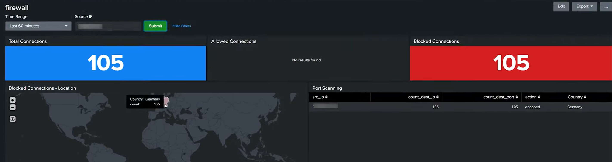
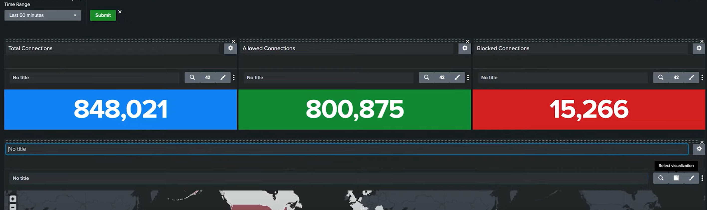

I created a new dashboard named "firewall" using classic dashboard.
I then added a input time range - so users can change the time whenever they want (Getting the total number of traffic connections today)

For this I am going to be using a sample data called botsv3
To use this dataset I just downloaded it from github then unzipped it on the Splunk path
	`C:\Program Files\Splunk\etc\apps
so it would create a folder named 
	`botsv3_data_set`
Lastly we just restart our splunk enterprise so that we can view the dataset
	`Settings -> Server Controls -> Restart Splunk`

so I current did some testing on my main index so, for this I just added a new panel for this using a single value and used the time range as time_token
index="botsv3" 
| stats count by action
| stats sum(count)
configured it with blue background and a title as "total"

after that I added another panel
index="botsv3" 
| stats count by action
| search action=allowed
| table count

after that  I added another panel
index="botsv3" 
| stats count by action
| search action=blocked OR action=dropped
| stats sum(count)

Next I would like to figure out "where the connections are coming from"
So for this specific panel I want to understand the following:
	source ip addresses that are hitting my firewall
	see all the geographical location on the ip addresses
	since we are only after the location, I just want to generalize it  by the country
	and use the world map as the visual representation for this
index="botsv3" action=blocked OR action=ignored
| table src_ip
| iplocation src_ip
| stats counts by Country
| geom geo_countries featureIdField="Country"

I also want to monitor suspicious probing activity on my network, so for this specific panel
index="botsv3"
| stats count(dest_ip) as count_dest_ip count(dest_port) as count_dest_port by src_ip action
| iplocation src_ip
| search count_dest_ip > 100 AND count_dest_port > 100 AND Country!="" AND Country!="Philippines"
| table src_ip count_desc_ip count_dest_port action Country

Since this dashboard will be used mainly for investigation and we need to narrow down to a specific IP address
I added a Text Input so it will check the Source IP from everything

Lastly I changed the search to add the source IP. So its like this for every panel
index="botsv3" src_ip=$ip_token$
| stats count by action
| stats sum(count)

I just added  src_ip=$ip_token$ for every panel and that would be the first dashboard for firewall testing
Now this will mostly be for checking/investigating IP addresses and checking which country specifically is targetting my exposed network

Dashboard Sample

